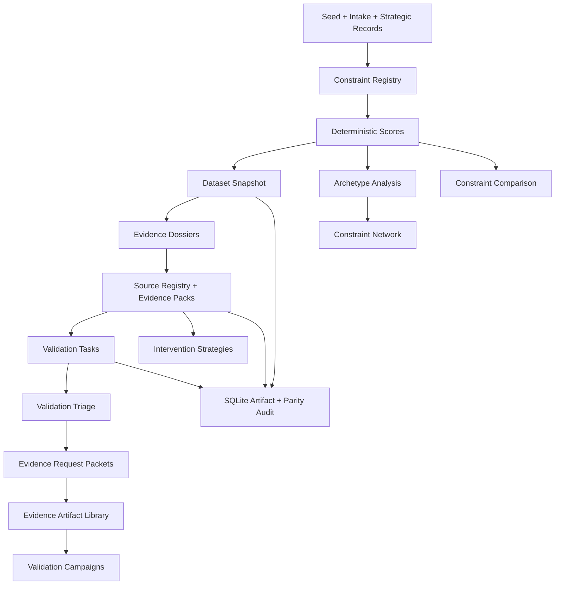
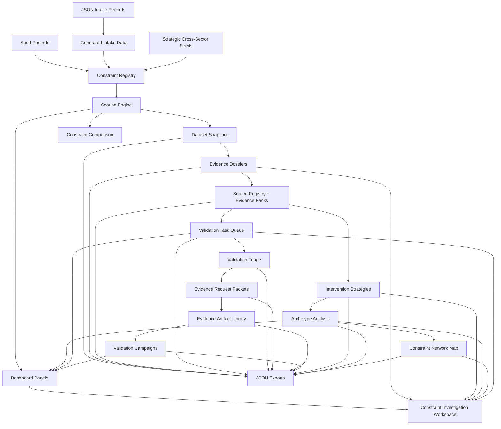

# Economic X-Ray Vision


A local-first constraint intelligence engine for mapping recurring bottlenecks, validation gaps, and intervention paths across strategic operating systems.

Economic X-Ray Vision is an experimental TypeScript + Next.js system for identifying hidden friction before it becomes visible in late-stage outcome metrics. It is not a generic dashboard. It models the queues, handoffs, evidence gaps, approval loops, and capacity mismatches that quietly slow systems down.

## Problem Statement

Organizations and industries often fail to move work forward because of hidden constraints rather than one obvious failure point. The recurring patterns include:

- Queue backlogs
- Documentation drag
- Handoff leakage
- Manual verification
- Permitting delays
- Equipment bottlenecks
- Data fragmentation
- Capacity mismatch
- Evidence gaps

Traditional metrics usually show the outcome after the damage is visible: revenue loss, complaints, inflation, utilization gaps, productivity drag, or project delay. This project asks a different question: can we structure and inspect the friction earlier?

## What The System Does

Economic X-Ray Vision currently:

- Maps constraint records across strategic operating domains.
- Scores priority, severity, solvability, validation confidence, graph position, and strategic opportunity.
- Validates evidence quality and identifies missing proof.
- Classifies constraints into recurring bottleneck archetypes.
- Detects cross-industry analogs, such as similar queue or documentation patterns in different sectors.
- Builds evidence dossiers for each record.
- Separates source metadata, claim support, evidence gaps, and provenance into local evidence packs.
- Generates a validation task workflow for source upgrades, evidence gaps, weak claim support, and validation-dependent interventions.
- Compresses raw validation tasks into triaged next-best validation actions.
- Builds evidence request packets for the highest-priority validation actions.
- Defines an evidence artifact library for the documents, datasets, observations, metrics, or primary records needed to validate claims.
- Plans fast, standard, and deep validation campaigns from triage, source, evidence, and comparison signals.
- Generates a separate local analyst state template for review, collection, assignment, blocking, and campaign progress tracking.
- Proposes deterministic intervention strategies and first experiments.
- Compares 2-4 constraints side by side to explain why one outranks another.
- Opens a dedicated investigation workspace for each constraint, linking evidence, validation workflow, analogs, archetype reasoning, and intervention strategy.
- Renders a constraint network map that connects records to archetypes, industries, cross-sector analogs, and intervention paths.
- Supports network search, filters, and focused neighborhoods via links such as `/network?focus=hc-admin-001`.
- Exports local JSON artifacts and a local SQLite artifact for audit-first inspection.

## Why It Matters

This project is an attempt to model hidden constraints before they harden into late-stage outcomes. The useful signal is often not the final KPI. It is the earlier friction: the queue that keeps aging, the document packet that keeps bouncing back, the handoff that loses ownership, or the equipment lead time that silently governs an entire project plan.

The system treats most records as hypotheses until validation improves. That is intentional. The goal is not fake certainty. The goal is structured, inspectable intelligence.

## Current Scope

The current dataset spans eleven strategic operating domains:

- Healthcare administration
- Data centers / AI infrastructure
- Energy / grid / interconnection
- Power generation / nuclear / SMR
- Infrastructure / permitting / construction
- Semiconductors / advanced manufacturing
- Metals / mining / critical inputs
- Robotics / automation deployment
- Aerospace / defense / space manufacturing
- Logistics / supply chain / industrial equipment
- Public-sector administration / compliance

Current metrics:

- 84 constraint records
- 11 industries
- 23 bottleneck archetypes
- 20 cross-industry analog pairs
- 39 source records
- 84 evidence packs
- 514 generated validation tasks
- 10 triaged top validation actions
- 10 evidence request packets
- 459 generated evidence artifact needs
- 3 validation campaign modes
- 1060 local analyst state template records
- Local-first data and scripts
- Deterministic scoring
- No external APIs
- No scraping

## System Modules

- **Constraint Registry**: combines healthcare seed records, generated intake records, and strategic cross-sector seed records.
- **Scoring Engine**: computes deterministic priority, validation, graph, archetype, and strategic scores.
- **Dataset Operations**: builds and audits local dataset snapshots.
- **Evidence Dossier Engine**: derives evidence gaps, proof/disproof conditions, red-team questions, and validation priority.
- **Source Registry + Evidence Packs**: structures source locators, claim support, citation gaps, provenance limits, and defensibility scores.
- **Validation Workflow**: classifies records as hypotheses, partially supported claims, or decision-ready candidates.
- **Validation Task Engine**: generates a local analyst queue from source gaps, weak evidence, low defensibility, and validation-dependent interventions.
- **Validation Triage Engine**: compresses raw tasks by constraint into ranked next-best validation actions.
- **Evidence Packet Engine**: turns top validation actions into artifact requests with pass/fail criteria.
- **Evidence Artifact Library**: defines the specific documents, observations, metrics, or primary records still needed for validation.
- **Validation Campaign Planner**: groups top actions into fast, standard, and deep campaign plans.
- **Local Analyst State**: creates a separate non-complete template for tracking future human review and artifact collection progress.
- **Intervention Simulator**: proposes first experiments, success metrics, failure modes, and action confidence.
- **Constraint Archetype Engine**: classifies recurring bottleneck patterns across sectors.
- **Cross-Industry Analog Engine**: finds similar constraints in different industries.
- **Constraint Network Engine**: builds a local graph of constraint, archetype, industry, analog, and intervention relationships, with search/filter/focus exploration in the UI.
- **Comparison Workspace**: explains relative ranking differences across scores, evidence, source defensibility, interventions, archetypes, and network context.
- **Investigation Workspace**: renders a focused record-level view from `/constraints/[id]` with the full evidence-to-validation-to-intervention chain.
- **Dashboard UI**: displays portfolio health, evidence workflow, validation tasks, sources, interventions, archetypes, filters, expanded record inspection, and links into each workspace.

## Route Map

- `/`: main constraint intelligence dashboard and filtered record list.
- `/validation`: validation workbench with triage, evidence packets, and raw task exploration.
- `/campaigns`: validation campaign planner with fast, standard, and deep campaign modes.
- `/campaigns/[id]`: execution workspace for one validation campaign.
- `/compare`: side-by-side constraint comparison workspace.
- `/sources`: source registry workspace for provenance, citation status, and constraint dependencies.
- `/network`: constraint network explorer with search, filters, and focus links.
- `/network?focus=hc-admin-001`: focused network neighborhood for one constraint.
- `/constraints/[id]`: dedicated investigation workspace for one constraint.

## Data Pipeline Map



## Architecture



## Screenshots

### System Overview

The opening dashboard frames the system, current scope, scoring model, and portfolio-level metrics.


### Dataset Health + Evidence Dossiers

Dataset health and evidence dossiers show data quality, validation coverage, evidence gaps, and claim readiness.


### Intervention Simulator + Archetype Intelligence

The intervention and archetype panels connect validation-aware action strategy with recurring cross-sector bottleneck patterns.


### Constraint List + Inspection Workflow

The constraint list supports filtering by industry and archetype, plus expanded inspection of evidence, scores, interventions, and archetype reasoning.


## How To Run

```bash
npm install
npm run dev
```

Open `http://localhost:3000`.

Useful checks and exports:

```bash
npm run check
npm run dataset
npm run evidence
npm run sources
npm run intervention
npm run archetype
npm run network
npm run tasks
npm run triage
npm run evidence-packets
npm run artifacts
npm run campaigns
npm run analyst-state
npm run coverage
npm run sqlite
```

## Local Export Artifacts

- `data/exports/constraint_dataset_snapshot.json`
- `data/exports/evidence_dossiers.json`
- `data/exports/source_registry.json`
- `data/exports/evidence_packs.json`
- `data/exports/intervention_strategies.json`
- `data/exports/archetype_analysis.json`
- `data/exports/constraint_network.json`
- `data/exports/validation_tasks.json`
- `data/exports/validation_triage.json`
- `data/exports/validation_evidence_packets.json`
- `data/exports/evidence_artifact_library.json`
- `data/exports/validation_campaigns.json`
- `data/exports/analyst_state_template.json`
- `data/exports/coverage_density_report.json`
- `data/exports/constraint_intelligence.sqlite`

Generated exports preserve existing `generated_at` values when semantic content is unchanged, which prevents meaningless Git diffs during repeated local checks.

## Documentation

- [Architecture](docs/ARCHITECTURE.md)
- [Data Pipeline](docs/DATA_PIPELINE.md)
- [Scoring and Validation](docs/SCORING_AND_VALIDATION.md)
- [Constraint Archetypes](docs/CONSTRAINT_ARCHETYPES.md)
- [Intervention Strategy](docs/INTERVENTION_STRATEGY.md)
- [Demo Walkthrough](docs/DEMO_WALKTHROUGH.md)
- [Screenshot Guide](docs/SCREENSHOT_GUIDE.md)
- [Portfolio Summary](docs/PORTFOLIO_SUMMARY.md)

## Project Status

Economic X-Ray Vision is an experimental local-first intelligence engine. It is not a production SaaS product, does not include authentication, does not run cloud services, and does not call external AI or scraping APIs.

SQLite is available as a local build artifact at `data/exports/constraint_intelligence.sqlite`, with tables for constraints, scores, sources, evidence packs, validation tasks, and build metadata. The current app still runs from local TypeScript data and generated JSON artifacts; runtime SQLite reads are intentionally not wired yet.

## Design Principles

- Deterministic scoring over opaque ranking.
- Inspectable logic over hidden model output.
- Evidence humility over false certainty.
- Hypotheses before claims.
- Human analyst state stays separate from generated intelligence.
- Local-first data and exports.
- No hidden external services.
- No fake ROI claims.
- No invented citations.

## Support Development

If this project is useful or you want to support continued local-first intelligence tooling, you can sponsor development through GitHub Sponsors.

[](https://github.com/sponsors/EtherTabu)

## Roadmap

Future directions:

- Local analyst state for notes, artifact collection status, task status history, and campaign progress.
- Evidence artifact intake workflow for attaching collected documents, URLs, files, and observation records.
- Runtime SQLite read pilot once the artifact workflow remains stable.
- Real source ingestion with explicit provenance.
- Richer validation task states and reviewer notes.
- Domain-specific evidence packs.
- Benchmarking against real case studies.
