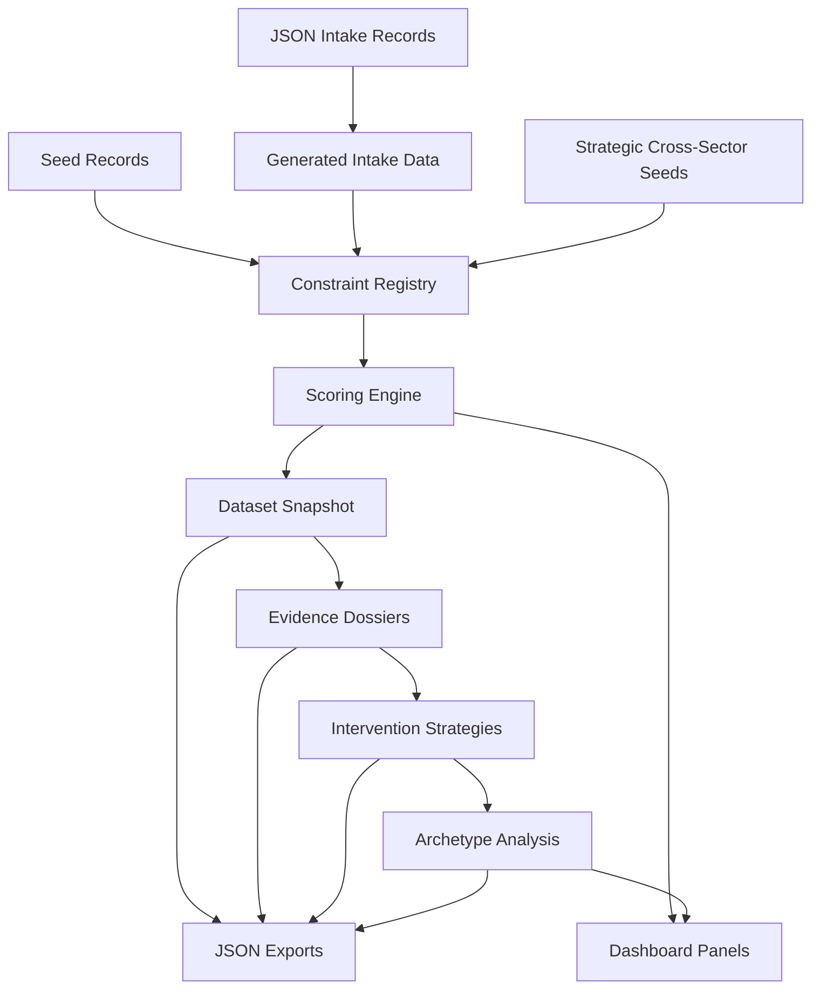
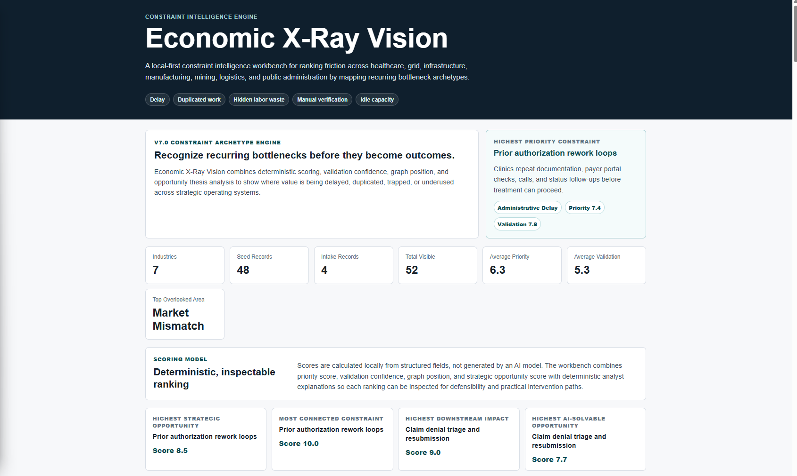
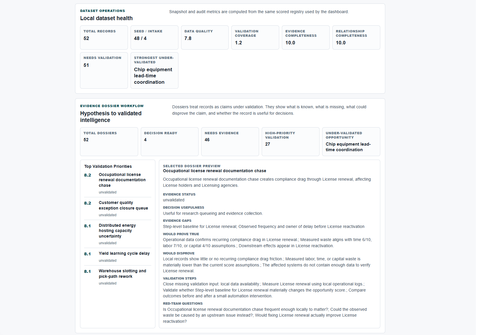
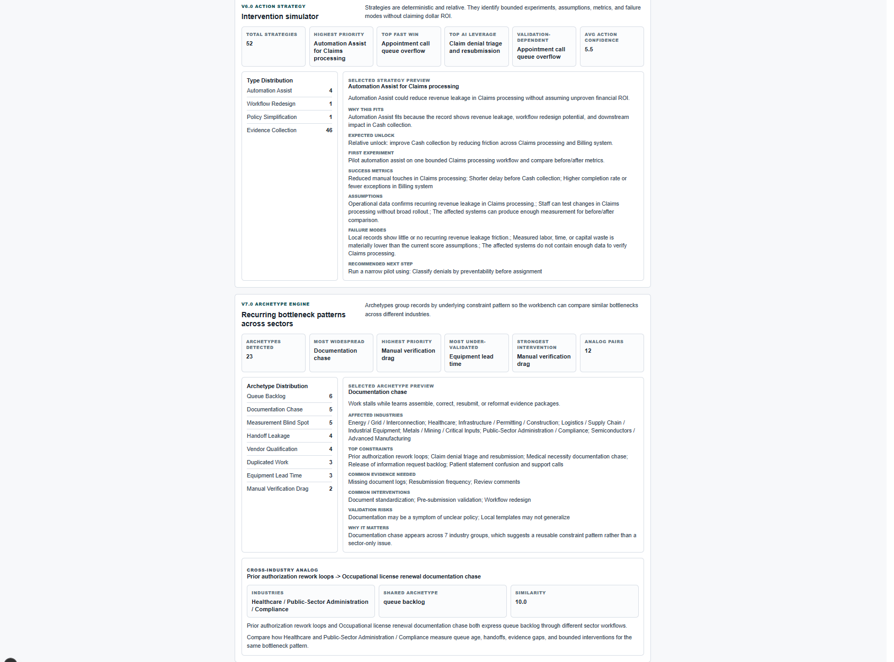
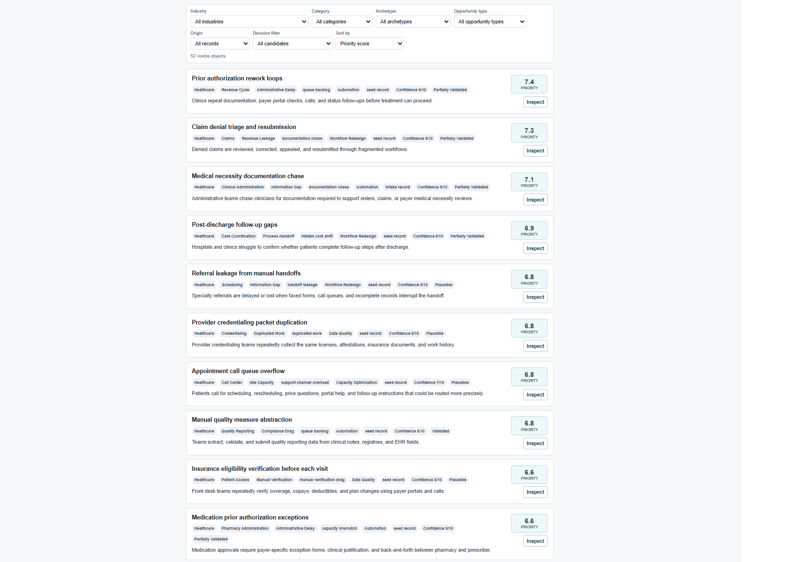

# Economic X-Ray Vision

A local-first constraint intelligence engine for mapping recurring bottlenecks, validation gaps, and intervention paths across strategic operating systems.

Economic X-Ray Vision is an experimental TypeScript + Next.js system for identifying hidden friction before it becomes visible in late-stage outcome metrics. It is not a generic dashboard. It models the queues, handoffs, evidence gaps, approval loops, and capacity mismatches that quietly slow systems down.

## Problem Statement

Organizations and industries often fail to move work forward because of hidden constraints rather than one obvious failure point. The recurring patterns include:

- Queue backlogs
- Documentation drag
- Handoff leakage
- Manual verification
- Permitting delays
- Equipment bottlenecks
- Data fragmentation
- Capacity mismatch
- Evidence gaps

Traditional metrics usually show the outcome after the damage is visible: revenue loss, complaints, inflation, utilization gaps, productivity drag, or project delay. This project asks a different question: can we structure and inspect the friction earlier?

## What The System Does

Economic X-Ray Vision currently:

- Maps constraint records across strategic operating domains.
- Scores priority, severity, solvability, validation confidence, graph position, and strategic opportunity.
- Validates evidence quality and identifies missing proof.
- Classifies constraints into recurring bottleneck archetypes.
- Detects cross-industry analogs, such as similar queue or documentation patterns in different sectors.
- Builds evidence dossiers for each record.
- Proposes deterministic intervention strategies and first experiments.
- Exports local JSON artifacts for dataset, evidence, intervention, and archetype analysis.

## Why It Matters

This project is an attempt to model hidden constraints before they harden into late-stage outcomes. The useful signal is often not the final KPI. It is the earlier friction: the queue that keeps aging, the document packet that keeps bouncing back, the handoff that loses ownership, or the equipment lead time that silently governs an entire project plan.

The system treats most records as hypotheses until validation improves. That is intentional. The goal is not fake certainty. The goal is structured, inspectable intelligence.

## Current Scope

The V7 dataset contains:

- Healthcare administration
- Energy / grid / interconnection
- Infrastructure / permitting / construction
- Semiconductors / advanced manufacturing
- Metals / mining / critical inputs
- Logistics / supply chain / industrial equipment
- Public-sector administration / compliance

Current metrics:

- 52 constraint records
- 7 industries
- 23 bottleneck archetypes
- 20 cross-industry analog pairs
- Local-first data and scripts
- Deterministic scoring
- No external APIs
- No scraping

## System Modules

- **Constraint Registry**: combines healthcare seed records, generated intake records, and strategic cross-sector seed records.
- **Scoring Engine**: computes deterministic priority, validation, graph, archetype, and strategic scores.
- **Dataset Operations**: builds and audits local dataset snapshots.
- **Evidence Dossier Engine**: derives evidence gaps, proof/disproof conditions, red-team questions, and validation priority.
- **Validation Workflow**: classifies records as hypotheses, partially supported claims, or decision-ready candidates.
- **Intervention Simulator**: proposes first experiments, success metrics, failure modes, and action confidence.
- **Constraint Archetype Engine**: classifies recurring bottleneck patterns across sectors.
- **Cross-Industry Analog Engine**: finds similar constraints in different industries.
- **Dashboard UI**: displays portfolio health, evidence workflow, interventions, archetypes, filters, and expanded record inspection.

## Architecture



## Screenshots

### System Overview

The opening dashboard frames the system, current scope, scoring model, and portfolio-level metrics.



### Dataset Health + Evidence Dossiers

Dataset health and evidence dossiers show data quality, validation coverage, evidence gaps, and claim readiness.



### Intervention Simulator + Archetype Intelligence

The intervention and archetype panels connect validation-aware action strategy with recurring cross-sector bottleneck patterns.



### Constraint List + Inspection Workflow

The constraint list supports filtering by industry and archetype, plus expanded inspection of evidence, scores, interventions, and archetype reasoning.



## How To Run

```bash
npm install
npm run dev
```

Open `http://localhost:3000`.

Useful checks and exports:

```bash
npm run check
npm run dataset
npm run evidence
npm run intervention
npm run archetype
```

## Local Export Artifacts

- `data/exports/constraint_dataset_snapshot.json`
- `data/exports/evidence_dossiers.json`
- `data/exports/intervention_strategies.json`
- `data/exports/archetype_analysis.json`

Generated exports preserve existing `generated_at` values when semantic content is unchanged, which prevents meaningless Git diffs during repeated local checks.

## Documentation

- [Architecture](docs/ARCHITECTURE.md)
- [Data Pipeline](docs/DATA_PIPELINE.md)
- [Scoring and Validation](docs/SCORING_AND_VALIDATION.md)
- [Constraint Archetypes](docs/CONSTRAINT_ARCHETYPES.md)
- [Intervention Strategy](docs/INTERVENTION_STRATEGY.md)
- [Demo Walkthrough](docs/DEMO_WALKTHROUGH.md)
- [Screenshot Guide](docs/SCREENSHOT_GUIDE.md)
- [Portfolio Summary](docs/PORTFOLIO_SUMMARY.md)

## Project Status

Economic X-Ray Vision is an experimental local-first intelligence engine. It is not a production SaaS product, does not include authentication, does not run cloud services, and does not call external AI or scraping APIs.

SQLite is represented by `db/schema.sql` as the planned persistence target, but the current app still runs from local TypeScript data and generated JSON artifacts.

## Design Principles

- Deterministic scoring over opaque ranking.
- Inspectable logic over hidden model output.
- Evidence humility over false certainty.
- Hypotheses before claims.
- Local-first data and exports.
- No hidden external services.
- No fake ROI claims.
- No invented citations.

## Roadmap

Future directions:

- Real source ingestion with explicit provenance.
- SQLite persistence for local dataset operations.
- Richer validation workflow states and reviewer notes.
- Domain-specific evidence packs.
- Graph visualization for constraint relationships and analogs.
- Benchmarking against real case studies.
