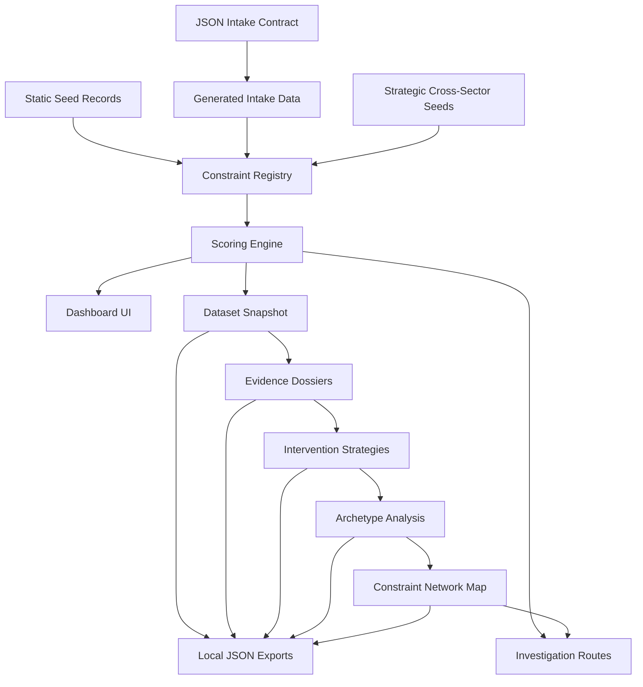

# Architecture

Economic X-Ray Vision is a local-first constraint intelligence engine. It structures constraint hypotheses, scores them deterministically, evaluates evidence quality, proposes validation and intervention paths, identifies recurring bottleneck archetypes across industries, and maps relationships between constraints.

The current system is a Next.js app backed by TypeScript data modules, local JSON intake records, generated TypeScript data, and JSON export artifacts. It does not use external APIs, cloud services, authentication, scraping, or SQLite runtime wiring.

## System Shape

## Major Modules

- `src/data/healthcareConstraints.ts`: original healthcare administration baseline records.
- `data/intake/sample_constraints.json`: structured JSON intake examples.
- `src/data/generated/intakeConstraints.ts`: generated app-consumable intake records.
- `src/data/strategicConstraintSeeds.ts`: cross-sector strategic constraint hypotheses.
- `src/data/constraintRegistry.ts`: combined registry used by the app.
- `src/lib/scoring.ts`: deterministic score calculations.
- `src/lib/evidenceDossier.ts`: evidence dossier generation.
- `src/lib/interventionSimulator.ts`: intervention strategy generation.
- `src/lib/constraintArchetypes.ts`: reusable bottleneck taxonomy.
- `src/lib/archetypeAnalysis.ts`: archetype distribution and portfolio analysis.
- `src/lib/crossIndustryAnalogs.ts`: cross-industry similarity detection.
- `src/lib/constraintNetwork.ts`: graph builder for constraint, archetype, industry, analog, and intervention relationships.
- `scripts/`: local validation, build, audit, and export operations.

## Network Layer

The constraint network map is built locally from the existing registry and deterministic engines. It creates constraint, archetype, industry, and intervention nodes, then connects them with edges for archetype membership, industry membership, intervention type, and cross-industry analogs.

The network export is written to `data/exports/constraint_network.json`. It uses stable generated metadata so repeated checks do not create meaningless timestamp diffs when the graph content has not changed.

## Why Deterministic Logic Matters

The project is meant to be inspectable. Scores and explanations are derived from structured fields, not hidden model calls. This makes every ranking debuggable, repeatable, and suitable for local portfolio review.

Deterministic logic also keeps the system honest: weak evidence lowers confidence, high complexity lowers near-term action priority, and under-validated records produce measurement-first recommendations instead of rollout claims.
