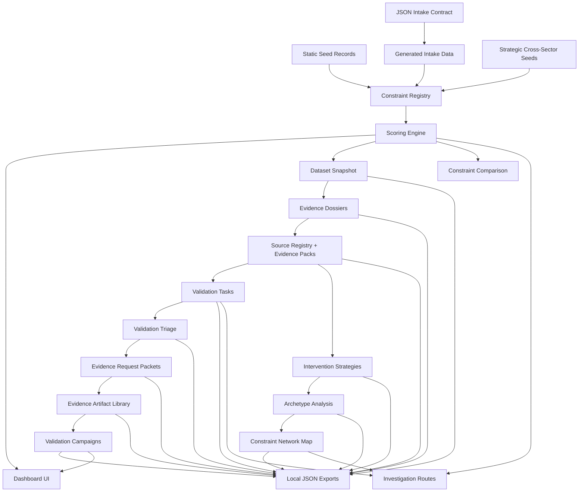

# Architecture

Economic X-Ray Vision is a local-first constraint intelligence engine. It structures constraint hypotheses, scores them deterministically, evaluates evidence quality, separates source provenance from claim support, proposes validation and intervention paths, identifies recurring bottleneck archetypes across industries, maps relationships between constraints, compares constraints, and turns validation debt into campaign plans.

The current system is a Next.js app backed by TypeScript data modules, local JSON intake records, generated TypeScript data, JSON export artifacts, and a generated local SQLite artifact. It does not use external APIs, cloud services, authentication, scraping, or SQLite runtime wiring.

## System Shape

## Major Modules

- `src/data/healthcareConstraints.ts`: original healthcare administration baseline records.
- `data/intake/sample_constraints.json`: structured JSON intake examples.
- `src/data/generated/intakeConstraints.ts`: generated app-consumable intake records.
- `src/data/strategicConstraintSeeds.ts`: cross-sector strategic constraint hypotheses.
- `src/data/constraintRegistry.ts`: combined registry used by the app.
- `src/lib/scoring.ts`: deterministic score calculations.
- `src/lib/evidenceDossier.ts`: evidence dossier generation.
- `src/lib/sourceRegistry.ts`: source locator registry and provenance metadata.
- `src/lib/evidencePacks.ts`: claim support, source coverage, provenance, and defensibility pack generation.
- `src/lib/validationTasks.ts`: generated validation task workflow.
- `src/lib/validationTriage.ts`: constraint-level validation burden and next-best-action logic.
- `src/lib/validationEvidencePackets.ts`: evidence request packet generation.
- `src/lib/validationCampaigns.ts`: fast, standard, and deep validation campaign planning.
- `src/lib/interventionSimulator.ts`: intervention strategy generation.
- `src/lib/constraintArchetypes.ts`: reusable bottleneck taxonomy.
- `src/lib/archetypeAnalysis.ts`: archetype distribution and portfolio analysis.
- `src/lib/crossIndustryAnalogs.ts`: cross-industry similarity detection.
- `src/lib/constraintNetwork.ts`: graph builder for constraint, archetype, industry, analog, and intervention relationships.
- `src/lib/constraintComparison.ts`: deterministic side-by-side ranking comparison.
- `src/lib/sqliteReadModel.ts`: SQLite read-model helpers for parity auditing.
- `scripts/`: local validation, build, audit, and export operations.

## Route Map

- `/`: main dashboard with portfolio panels, filters, expanded constraint cards, and workspace links.
- `/validation`: validation workbench with triage, evidence request packets, and raw validation task exploration.
- `/campaigns`: validation campaign planner for fast, standard, and deep validation plans.
- `/compare`: side-by-side constraint comparison workspace.
- `/sources`: source registry workspace for provenance, citation status, and constraint dependencies.
- `/network`: relationship map with search, industry/archetype/evidence filters, and focus mode.
- `/constraints/[id]`: dedicated investigation workspace for one constraint.

## Network Layer

The constraint network map is built locally from the existing registry and deterministic engines. It creates constraint, archetype, industry, and intervention nodes, then connects them with edges for archetype membership, industry membership, intervention type, and cross-industry analogs.

The `/network` route renders the static graph into an interactive local explorer. It supports text search, industry filtering, archetype filtering, evidence-risk filtering, and focus links such as `/network?focus=hc-admin-001`. Focus mode shows the immediate neighborhood around one constraint without fetching external data.

The network export is written to `data/exports/constraint_network.json`. It uses stable generated metadata so repeated checks do not create meaningless timestamp diffs when the graph content has not changed.

## Validation Tasks

The validation task workflow turns existing evidence weaknesses into a deterministic analyst queue. Tasks are generated from source registry gaps, evidence packs, evidence dossier gaps, validation confidence, and intervention action confidence. The workflow is not editable task persistence; it is a local, inspectable queue that answers which claims, sources, and validation blockers should be handled next.

The `/validation` route renders the generated queue with filters for task type, industry, severity, and status. Each task links back to `/constraints/[id]` and `/network?focus=[id]`.

The task export is written to `data/exports/validation_tasks.json`. The SQLite artifact also includes a `validation_tasks` table, but the app runtime still reads from TypeScript and generated JSON rather than querying SQLite directly.

## Validation Triage, Packets, And Campaigns

The triage layer compresses raw validation tasks into constraint-level priorities. It clusters blockers into source, evidence, metric, and intervention-blocking groups, then selects one next-best validation action per constraint. This is exported to `data/exports/validation_triage.json`.

Evidence request packets turn the top triage queue into artifact requests with pass/fail criteria and expected confidence impact. These packets are exported to `data/exports/validation_evidence_packets.json`.

The evidence artifact library translates packet, source, and triage gaps into the specific artifact needs that future collection should satisfy: primary documents, source URLs, local observations, metric definitions, claim-support memos, and intervention pilot plans. It is exported to `data/exports/evidence_artifact_library.json` and remains a planning contract, not evidence ingestion.

Validation campaigns group the highest-value validation work into fast, standard, and deep plans. Campaigns explain selected constraints, required artifacts, source upgrades, expected confidence lift, effort level, and decision use. They are exported to `data/exports/validation_campaigns.json`.

## Evidence Packs

V11 adds a source registry and evidence pack layer. Source records preserve the current source names as local source locators and label whether each source needs a URL, a primary document, or local observation. Evidence packs connect those sources to specific claim-support statements, unresolved gaps, provenance notes, audit flags, and a defensibility score.

This does not invent citations or fetch external documents. It makes the current evidence status more inspectable and gives future ingestion work a cleaner target.

## Comparison And SQLite Parity

The `/compare` route explains why one constraint outranks another by comparing priority, validation confidence, evidence defensibility, source quality, intervention readiness, validation burden, archetypes, and network context.

The SQLite artifact at `data/exports/constraint_intelligence.sqlite` is a local persistence artifact, not the app runtime source. Parity scripts compare JSON/static exports against SQLite tables for constraints, scores, sources, evidence packs, validation tasks, and source links. Gaps are reported explicitly rather than hidden.

## Why Deterministic Logic Matters

The project is meant to be inspectable. Scores and explanations are derived from structured fields, not hidden model calls. This makes every ranking debuggable, repeatable, and suitable for local portfolio review.

Deterministic logic also keeps the system honest: weak evidence lowers confidence, high complexity lowers near-term action priority, and under-validated records produce measurement-first recommendations instead of rollout claims.
