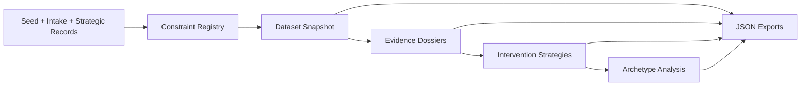

# Data Pipeline

The project uses a local pipeline that keeps app data, generated exports, and audit reports aligned.

## Inputs

- `src/data/healthcareConstraints.ts`: hand-authored healthcare administration seed records.
- `data/intake/sample_constraints.json`: structured JSON intake records.
- `src/data/strategicConstraintSeeds.ts`: hand-authored cross-sector strategic hypotheses.

## Intake Flow

1. `npm run validate` checks the JSON intake contract.
2. `npm run build:data` converts valid JSON intake records into `src/data/generated/intakeConstraints.ts`.
3. The dashboard imports `src/data/constraintRegistry.ts`, which combines healthcare records, generated intake records, and strategic seed records.

## Export Flow

## Scripts

- `npm run validate`: validates the intake JSON file.
- `npm run build:data`: validates intake and regenerates app-ready TypeScript intake data.
- `npm run dataset`: builds and audits the dataset snapshot.
- `npm run evidence`: builds evidence dossiers and audits validation priorities.
- `npm run intervention`: builds intervention strategies and audits action candidates.
- `npm run archetype`: builds archetype analysis and audits cross-industry analogs.
- `npm run check`: runs the full validation, generation, audit, lint, and build sequence.

## Local Export Artifacts

- `data/exports/constraint_dataset_snapshot.json`
- `data/exports/evidence_dossiers.json`
- `data/exports/intervention_strategies.json`
- `data/exports/archetype_analysis.json`

Exports are deterministic where possible. If semantic content is unchanged, existing `generated_at` values are preserved to avoid meaningless Git diffs.

