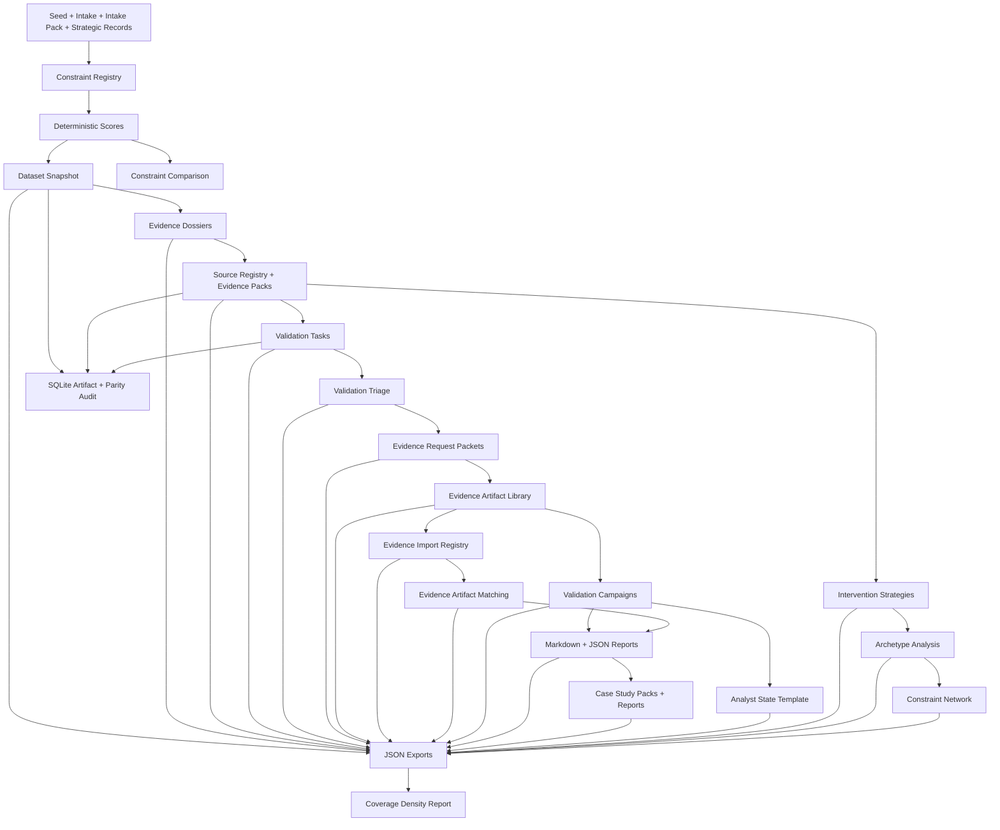

# Data Pipeline

The project uses a local pipeline that keeps app data, generated exports, and audit reports aligned.

## Inputs

- `src/data/healthcareConstraints.ts`: hand-authored healthcare administration seed records.
- `data/intake/sample_constraints.json`: structured JSON intake records.
- `data/intake/packs/*.json`: optional structured intake expansion packs.
- `data/intake/templates/`: copy-only capture templates that are not processed as real data.
- `src/data/strategicConstraintSeeds.ts`: hand-authored cross-sector strategic hypotheses.
- `data/evidence/imports/*.json`: optional human-authored evidence import metadata packs.
- `data/evidence/templates/`: copy-only evidence import templates that are not processed as real data.

## Intake Flow

1. `npm run validate` checks `data/intake/sample_constraints.json` and every `data/intake/packs/*.json` file.
2. Intake validation enforces required fields, known values, score ranges, measurable validation language, evidence gaps, operational system/workflow language, and honest evidence posture.
3. `npm run build:data` converts valid JSON intake records into `src/data/generated/intakeConstraints.ts`.
4. The dashboard imports `src/data/constraintRegistry.ts`, which combines healthcare records, generated intake records, and strategic seed records.

Templates are deliberately excluded from the build path. Use `data/intake/templates/constraint_capture_template.json` and `docs/CONSTRAINT_CAPTURE_TEMPLATE.md` as copy sources only.

## Evidence Import Flow

1. Evidence artifact needs are generated first from packets, triage, source gaps, and campaigns.
2. Future human-authored import packs can be placed in `data/evidence/imports/*.json`.
3. `npm run evidence-imports` validates import metadata against existing artifact IDs, constraint IDs, and source record IDs.
4. The builder writes `data/exports/evidence_import_registry.json` and the auditor writes `data/exports/evidence_import_audit.json`.
5. `npm run evidence-matches` connects import metadata to artifact needs by explicit artifact IDs first, then weaker constraint or source candidate links.
6. Generated artifact statuses are not mutated. Imported evidence is reported as candidate, blocked, review-ready, or uncovered coverage until a future review workflow accepts it.

`data/evidence/templates/evidence_import_template.json` is a copy-only template and is deliberately excluded from the import build path.

## Export Flow

## Scripts

- `npm run validate`: validates the sample intake file and any intake pack JSON files.
- `npm run build:data`: validates intake and regenerates app-ready TypeScript intake data.
- `npm run dataset`: builds and audits the dataset snapshot.
- `npm run evidence`: builds evidence dossiers and audits validation priorities.
- `npm run sources`: builds source registry and evidence packs, then audits provenance and source gaps.
- `npm run intervention`: builds intervention strategies and audits action candidates.
- `npm run archetype`: builds archetype analysis and audits cross-industry analogs.
- `npm run network`: builds and audits the constraint network export.
- `npm run tasks`: builds and audits generated validation tasks.
- `npm run triage`: builds and audits constraint-level validation triage.
- `npm run evidence-packets`: builds and audits evidence request packets.
- `npm run artifacts`: builds and audits the evidence artifact library.
- `npm run evidence-imports`: builds and audits the evidence import registry and coverage report.
- `npm run evidence-matches`: builds and audits evidence-to-artifact matching and uncovered artifact coverage.
- `npm run campaigns`: builds and audits validation campaign plans.
- `npm run reports`: builds and audits Markdown and JSON analyst reports.
- `npm run case-studies`: builds and audits focused evidence-request-backed case studies.
- `npm run analyst-state`: builds and audits the local analyst state template.
- `npm run coverage`: builds upstream artifacts and audits frontier coverage density.
- `npm run sqlite`: builds, audits, inspects, and parity-checks the local SQLite artifact.
- `npm run check`: runs the full validation, generation, audit, lint, and build sequence.

## Local Export Artifacts

- `data/exports/constraint_dataset_snapshot.json`
- `data/exports/evidence_dossiers.json`
- `data/exports/source_registry.json`
- `data/exports/evidence_packs.json`
- `data/exports/intervention_strategies.json`
- `data/exports/archetype_analysis.json`
- `data/exports/constraint_network.json`
- `data/exports/validation_tasks.json`
- `data/exports/validation_triage.json`
- `data/exports/validation_evidence_packets.json`
- `data/exports/evidence_artifact_library.json`
- `data/exports/evidence_import_registry.json`
- `data/exports/evidence_import_audit.json`
- `data/exports/evidence_artifact_matches.json`
- `data/exports/validation_campaigns.json`
- `data/exports/reports/report_index.json`
- `data/exports/reports/*.md`
- `data/exports/reports/*.json`
- `data/exports/case_studies.json`
- `data/exports/case_study_reports/*.md`
- `data/exports/analyst_state_template.json`
- `data/exports/coverage_density_report.json`
- `data/exports/constraint_intelligence.sqlite`

Exports are deterministic where possible. If semantic content is unchanged, existing `generated_at` values are preserved to avoid meaningless Git diffs.

## Runtime Data Boundary

The Next.js app still renders from TypeScript modules and generated JSON-derived structures. SQLite is currently an audit and persistence artifact, not the runtime data source. This boundary keeps the UI stable while the database schema and parity checks mature.
