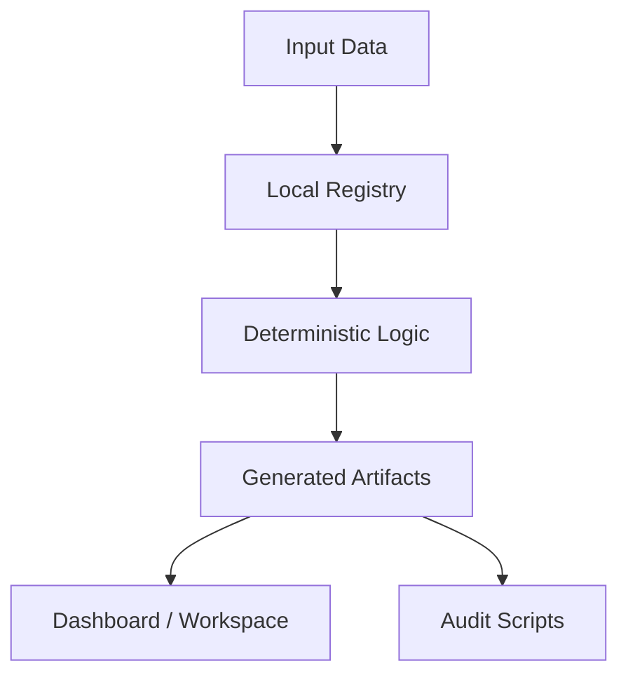

# GitHub Repository README Template

Use this as a starting point for future project READMEs. Replace placeholders, delete sections that do not apply, and keep claims accurate.

~~~markdown
# <Project Name>


<One-line project mission.>

<Project Name> is a <local-first / research / prototype / tool> for <clear problem>. It is designed to <main user outcome> without <important non-goal or false expectation>.

## Problem

<Explain the real problem in 2-4 short paragraphs. Avoid hype. Name the friction, workflow, risk, or user pain the project targets.>

Common patterns:

- <Pattern 1>
- <Pattern 2>
- <Pattern 3>
- <Pattern 4>

## What The System Does

- <Capability 1>
- <Capability 2>
- <Capability 3>
- <Capability 4>
- <Capability 5>

## Current Status

- Status: <experimental / working prototype / active portfolio system / archived>
- Records/items: <count or "not applicable">
- Data source: <static data / generated local files / SQLite artifact / etc.>
- External services: <none / list only real services>
- Production readiness: <not production / internal prototype / etc.>

## Architecture



## Screenshots

Add screenshots only after image files exist in the repo. Do not create broken links.

- [ ] `docs/screenshots/01-overview.png`
- [ ] `docs/screenshots/02-workflow.png`
- [ ] `docs/screenshots/03-detail-view.png`

## How To Run

```bash
npm install
npm run dev
```

Open `http://localhost:3000`.

## Validation And Checks

```bash
npm run check
```

Other useful scripts:

```bash
<npm run dataset>
<npm run audit>
<npm run export>
```

## Local Artifacts

- `<path/to/generated-artifact.json>`
- `<path/to/local-database.sqlite>`
- `<path/to/audit-report>`

## Design Principles

- Deterministic logic over hidden ranking.
- Inspectable data over black-box output.
- Evidence humility over false certainty.
- Local-first workflows before cloud services.
- No fake users, fake ROI, fake citations, or unsupported production claims.

## Roadmap

- <Near-term item 1>
- <Near-term item 2>
- <Near-term item 3>

Later:

- <Later item 1>
- <Later item 2>

## Support Development

If this project is useful or you want to support continued development:

[](https://github.com/sponsors/EtherTabu)
~~~

## Project-Specific Guidance

- Economic X-Ray Vision: emphasize constraint intelligence, validation campaigns, source/evidence discipline, and local-first auditability.
- TIDE LINE: replace this with the true project mission, current state, and stack before publishing.
- YFI: replace this with the true project mission, current state, and stack before publishing.
- Future projects: keep the same structure, but change the language to fit the actual product. Uniform structure is good; copied claims are not.
